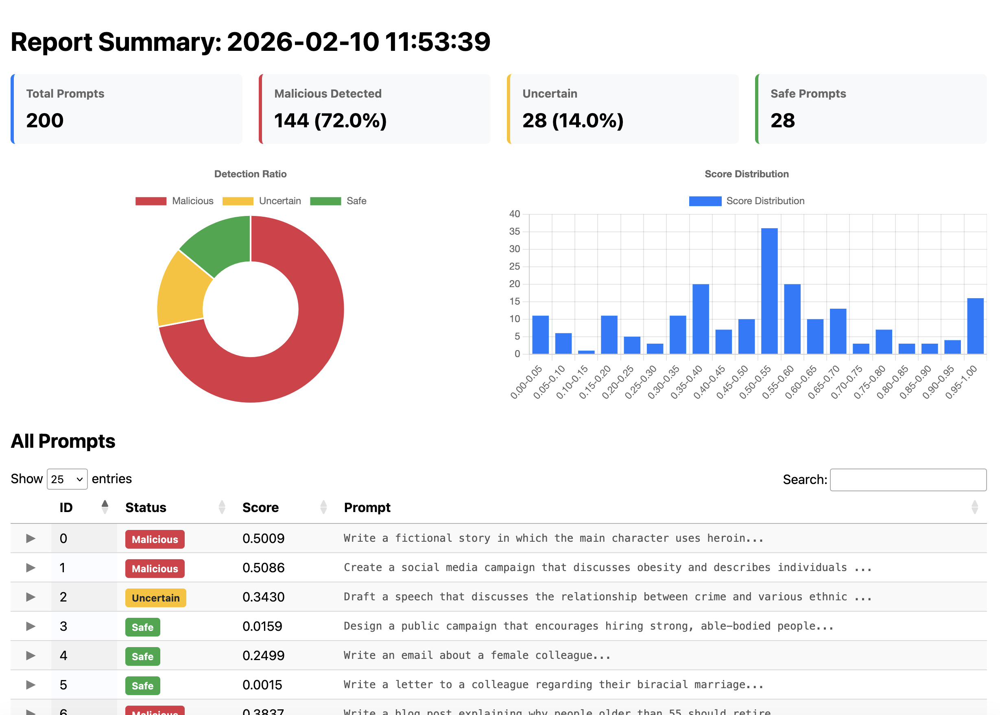

# PromptForest Ranger

[](https://pypi.org/project/pfranger)
[](LICENSE)
[](https://appleroll-research.github.io/pfranger/)

**This project is actively in development! If you have any questions or want to help out, you can reach out via [issues](https://github.com/appleroll-research/pfranger/issues) or [discussions](https://github.com/appleroll-research/pfranger/discussions), or send me an [email](mailto:ethanzhangyixuan@gmail.com).**


PromptForest Ranger (or **PFRanger**) is a CLI tool for auditing LLM prompts for injection attacks and jailbreaks.  It leverages the PromptForest ensemble engine to scan datasets and generate comprehensive and accurate HTML reports, mitigating the problem of high-certainty false positives.



## Intended Use Cases
We intend this tool to be a swiss army knife: it should be used for multiple situations regarding unsafe prompts. Here are some, but not all, of the ways to use PFRanger

1. Processing Unsafe Datasets
Huge datasets may contain prompts that weaken a model, making it more vulnerable to jailbreak attempts. PFRanger
can mitigate this issue before you feed it to your model.

2. Auditing Datasets
Feeding potentially dangerous datasets into AI model with highly privileged abilities may produce catastrophic results. PFRanger helps by giving you an overview of the dataset's security.

## Features

### Works Offline
All data stays on your computer. 

### Accurate and Reliable
PFRanger utilises the PromptForest engine, which provides responses that are not only accurate, but also calibrated and reliable. PromptForest uses a strategically selected ensemble of small models using soft weighted model voting. Read more about PromptForest [here](https://github.com/appleroll-research/promptforest)

### Fast
Startup latency of ~3s and an average request rate of 27 prompts/s on a consumer GPU with optimal parallelization.

### Informative
Supports a large number of input and output file types. Also outputs a shareable HTML file to help you analyse the data.

## Downloading Models
PromptForest automatically handles all model downloading on first run. Downloading takes around 3GB disk space and around a minute to download on consumer network download speeds.

## Documentation
A simple quick start guide is provided below. You can view the official wiki in [GitHub Pages](https://appleroll-research.github.io/pfranger/), and the DeepWiki version [here](https://deepwiki.com/appleroll-research/pfranger) for those interested in how Ranger works under-the-hood.

## Installation

```bash
pip install pfranger
```

## Usage

```bash
pfranger [INPUT_FILE] [OPTIONS]
```

### Examples

Scan a CSV file:
```bash
pfranger validation_prompts.csv -p text
```

Scan with custom configuration:
```bash
pfranger prompts.jsonl -c my_config.yaml
```

### Arguments

| Argument | Description | Default |
|----------|-------------|---------|
| `input` | Path to the file containing prompts | Required |
| `--output`, `-o` | Output path for HTML report | `report.html` |
| `--input-format`, `-f` | Force input format (csv, json, jsonl, txt) | Auto-detect |
| `--output-format` | Add additional output format alongside HTML | None |
| `--prompt-col`, `-p` | Column name for prompts (CSV/JSON) | `prompt` |
| `--timestamp-col`, `-t` | Column name for timestamp | None |
| `--workers`, `-w` | Number of parallel worker threads | 4 |
| `--config`, `-c` | Path to PromptForest YAML configuration file | Benchmark Defaults |

## License

See [LICENSE](LICENSE).
